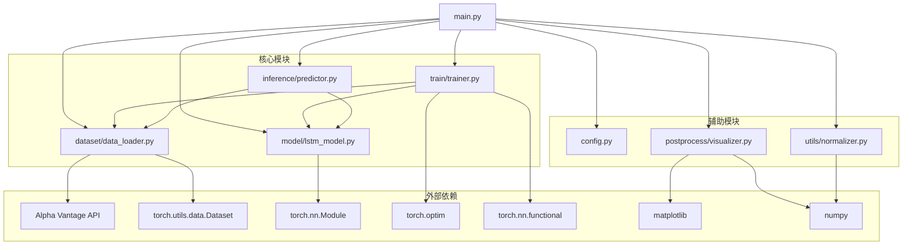
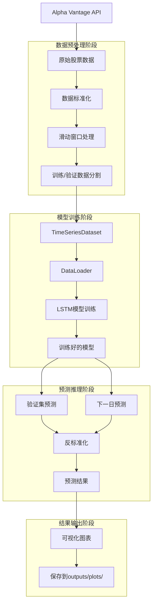

# 时间序列预测 PyTorch 项目结构文档

## 1. 项目架构概览

本项目是一个基于 PyTorch 的时间序列预测系统，专门用于股票价格预测。项目采用经典的机器学习管道架构，包含数据获取、预处理、模型训练、推理预测和可视化等完整流程。

### 核心技术栈
- **深度学习框架**: PyTorch
- **数据源**: Alpha Vantage API
- **模型架构**: LSTM (长短期记忆网络)
- **可视化**: Matplotlib
- **数据处理**: NumPy

### 项目特点
- 模块化设计，各功能独立封装
- 支持配置文件管理
- 完整的训练-验证-预测流程
- 丰富的可视化输出
- 标准化的数据预处理

## 2. 主要目录结构及其职责

```
time-series-forecasting-pytorch/
├── main.py                     # 主程序入口，协调整个预测流程
├── config.py                   # 配置文件，包含所有超参数和设置
├── requirements.txt            # 项目依赖包列表
├── .gitignore                  # Git忽略文件配置
│
├── dataset/                    # 数据处理模块
│   ├── __init__.py
│   └── data_loader.py          # 数据下载、预处理和数据集类
│
├── model/                      # 模型定义模块
│   ├── __init__.py
│   └── lstm_model.py           # LSTM模型架构定义
│
├── train/                      # 训练模块
│   ├── __init__.py
│   └── trainer.py              # 模型训练逻辑和训练循环
│
├── inference/                  # 推理模块
│   ├── __init__.py
│   └── predictor.py            # 模型预测功能
│
├── utils/                      # 工具模块
│   ├── __init__.py
│   └── normalizer.py           # 数据标准化工具
│
├── postprocess/                # 后处理模块
│   ├── __init__.py
│   └── visualizer.py           # 数据可视化和图表生成
│
└── outputs/                    # 输出目录
    └── plots/                  # 生成的图表文件
```

### 各目录详细职责

#### `dataset/` - 数据处理模块
- **主要职责**: 数据获取、预处理、数据集构建
- **核心文件**: `data_loader.py`
- **功能**: Alpha Vantage API数据下载、滑动窗口数据准备、PyTorch数据集封装

#### `model/` - 模型定义模块
- **主要职责**: 深度学习模型架构定义
- **核心文件**: `lstm_model.py`
- **功能**: LSTM神经网络模型实现、权重初始化、前向传播

#### `train/` - 训练模块
- **主要职责**: 模型训练和验证
- **核心文件**: `trainer.py`
- **功能**: 训练循环、损失计算、优化器和学习率调度

#### `inference/` - 推理模块
- **主要职责**: 模型预测和推理
- **核心文件**: `predictor.py`
- **功能**: 批量预测、单步预测、下一日价格预测

#### `utils/` - 工具模块
- **主要职责**: 通用工具和辅助功能
- **核心文件**: `normalizer.py`
- **功能**: 数据标准化和反标准化

#### `postprocess/` - 后处理模块
- **主要职责**: 结果可视化和输出管理
- **核心文件**: `visualizer.py`
- **功能**: 多种图表生成、结果保存、输出总结

## 3. 关键模块的依赖关系图



## 4. 核心类和接口的功能说明

### 4.1 LSTMModel (model/lstm_model.py)
```python
class LSTMModel(nn.Module):
```
**功能**: 实现LSTM神经网络模型
- **输入**: 时间序列数据窗口
- **输出**: 下一个时间点的预测值
- **架构**: 线性层 + ReLU + LSTM + Dropout + 输出层
- **特点**: 支持多层LSTM、可配置隐藏层大小和dropout率

**关键方法**:
- `__init__()`: 模型初始化，定义网络层
- `init_weights()`: 权重初始化，使用Kaiming和正交初始化
- `forward()`: 前向传播，定义数据流向

### 4.2 TimeSeriesDataset (dataset/data_loader.py)
```python
class TimeSeriesDataset(Dataset):
```
**功能**: PyTorch数据集包装器
- **继承**: torch.utils.data.Dataset
- **用途**: 将时间序列数据包装为PyTorch可用格式
- **特点**: 支持批量加载、自动维度扩展

**关键方法**:
- `__init__()`: 数据集初始化
- `__len__()`: 返回数据集大小
- `__getitem__()`: 获取单个样本

### 4.3 Normalizer (utils/normalizer.py)
```python
class Normalizer():
```
**功能**: 数据标准化工具
- **标准化方法**: Z-score标准化 (零均值单位方差)
- **用途**: 提高模型训练稳定性和收敛速度

**关键方法**:
- `fit_transform()`: 计算统计量并标准化数据
- `inverse_transform()`: 反标准化，恢复原始数据尺度

### 4.4 核心函数接口

#### 数据处理函数
- `download_data(config)`: 从Alpha Vantage下载股票数据
- `prepare_data_x(x, window_size)`: 创建滑动窗口输入序列
- `prepare_data_y(x, window_size)`: 创建预测目标序列

#### 训练函数
- `train_model(model, dataset_train, dataset_val, config)`: 完整的模型训练流程
- `run_epoch()`: 单个训练/验证轮次

#### 预测函数
- `predict_on_dataset(model, dataset, config)`: 数据集批量预测
- `predict_next_day(model, data_x_unseen, config)`: 下一日价格预测

#### 可视化函数
- `plot_raw_data()`: 绘制原始数据
- `plot_train_val_split()`: 绘制训练验证数据分割
- `plot_predictions()`: 绘制预测结果对比
- `plot_validation_zoom()`: 绘制验证数据放大图
- `plot_next_day_prediction()`: 绘制下一日预测

## 5. 数据流向图



## 6. API接口清单

### 6.1 外部API接口
- **Alpha Vantage API**: 股票数据获取
  - 端点: `get_daily()`
  - 参数: symbol, outputsize
  - 返回: 历史股票价格数据

### 6.2 内部模块接口

#### 数据接口
```python
# 数据下载
download_data(config) -> (data_date, data_close_price, num_data_points, display_date_range)

# 数据预处理
prepare_data_x(x, window_size) -> (output[:-1], output[-1])
prepare_data_y(x, window_size) -> output

# 数据标准化
normalizer.fit_transform(x) -> normalized_x
normalizer.inverse_transform(x) -> denormalized_x
```

#### 模型接口
```python
# 模型初始化
LSTMModel(input_size, hidden_layer_size, num_layers, output_size, dropout)

# 前向传播
model.forward(x) -> predictions
```

#### 训练接口
```python
# 模型训练
train_model(model, dataset_train, dataset_val, config) -> trained_model

# 单轮训练
run_epoch(model, dataloader, criterion, optimizer, scheduler, config, is_training) -> (epoch_loss, lr)
```

#### 预测接口
```python
# 数据集预测
predict_on_dataset(model, dataset, config) -> predicted_array

# 下一日预测
predict_next_day(model, data_x_unseen, config) -> prediction
```

#### 可视化接口
```python
# 各种绘图函数
plot_raw_data(data_date, data_close_price, config, num_data_points, display_date_range)
plot_train_val_split(data_date, to_plot_data_y_train, to_plot_data_y_val, config, num_data_points)
plot_predictions(data_date, data_close_price, to_plot_data_y_train_pred, to_plot_data_y_val_pred, config, num_data_points)
plot_validation_zoom(to_plot_data_date, to_plot_data_y_val_subset, to_plot_predicted_val, config)
plot_next_day_prediction(plot_date_test, to_plot_data_y_val, to_plot_data_y_val_pred, to_plot_data_y_test_pred, config)
```

## 7. 常见的代码模式和约定

### 7.1 配置管理模式
```python
# 统一的配置字典管理
CONFIG = {
    "data": {...},
    "model": {...},
    "training": {...},
    "plots": {...}
}

# 配置传递模式 - 所有函数都接收config参数
def function_name(data, config):
    param = config["section"]["parameter"]
```

### 7.2 模块初始化模式
```python
# 每个包都有__init__.py文件进行模块初始化
# 保持模块结构清晰
```

### 7.3 数据处理模式
```python
# 标准化模式
scaler = Normalizer()
normalized_data = scaler.fit_transform(raw_data)
# ... 处理 ...
original_data = scaler.inverse_transform(normalized_data)

# 滑动窗口模式
data_x, data_x_unseen = prepare_data_x(data, window_size)
data_y = prepare_data_y(data, window_size)
```

### 7.4 PyTorch标准模式
```python
# 模型定义模式
class Model(nn.Module):
    def __init__(self, ...):
        super().__init__()
        # 定义层
    
    def forward(self, x):
        # 前向传播
        return output

# 训练循环模式
model.train()  # 或 model.eval()
for batch in dataloader:
    optimizer.zero_grad()
    output = model(input)
    loss = criterion(output, target)
    loss.backward()
    optimizer.step()
```

### 7.5 可视化输出模式
```python
# 统一的图表保存模式
def plot_function(...):
    output_dir = ensure_output_dir()
    plt.figure(...)
    # 绘图代码
    filename = f"{output_dir}/prefix_{suffix}.png"
    plt.savefig(filename, bbox_inches='tight', dpi=100)
    plt.close()  # 释放内存
    print(f"图像已保存: {filename}")
```

### 7.6 设备管理模式
```python
# 统一的设备管理
device = config["training"]["device"]  # "cpu" or "cuda"
model = model.to(device)
data = data.to(device)
```

### 7.7 错误处理和日志模式
```python
# 简单的进度输出
print("步骤描述")
print("结果信息")

# 训练过程监控
print('Epoch[{}/{}] | loss train:{:.6f}, test:{:.6f} | lr:{:.6f}'
      .format(epoch, num_epochs, loss_train, loss_val, lr))
```

### 7.8 文件组织约定
- 每个功能模块独立成包
- 使用描述性的文件和函数命名
- 配置集中管理
- 输出文件统一管理
- 遵循Python PEP8代码风格

### 7.9 依赖管理约定
- 使用requirements.txt管理依赖
- 导入语句按标准库、第三方库、本地模块分组
- 避免循环导入

这个项目结构清晰、模块化程度高，遵循了良好的软件工程实践，适合用于时间序列预测任务的学习和生产环境部署。 